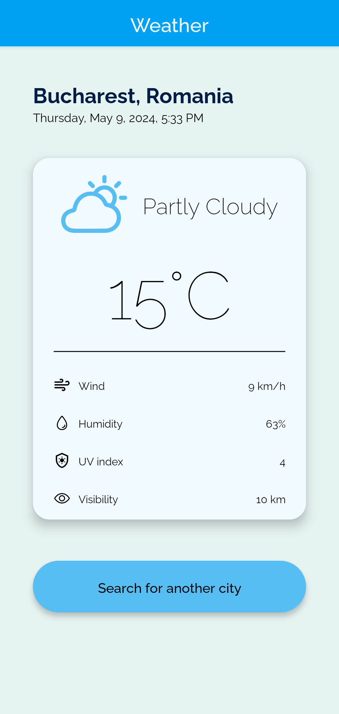
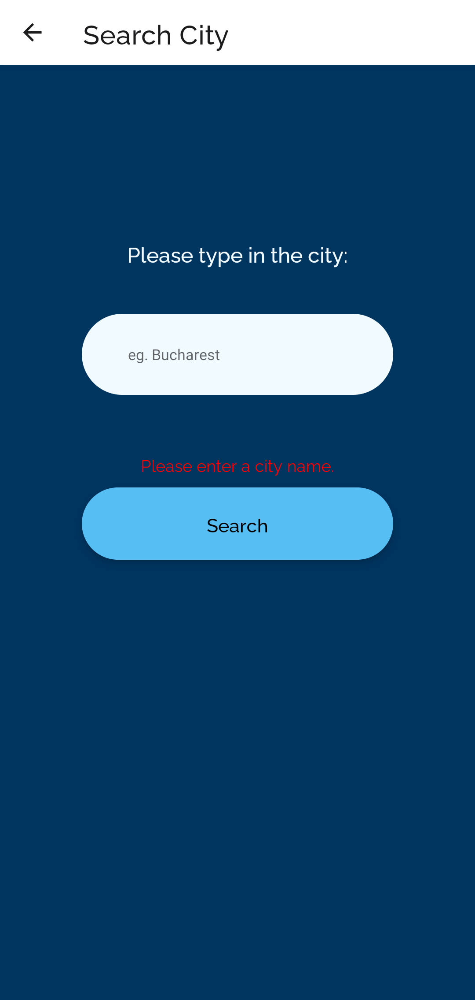
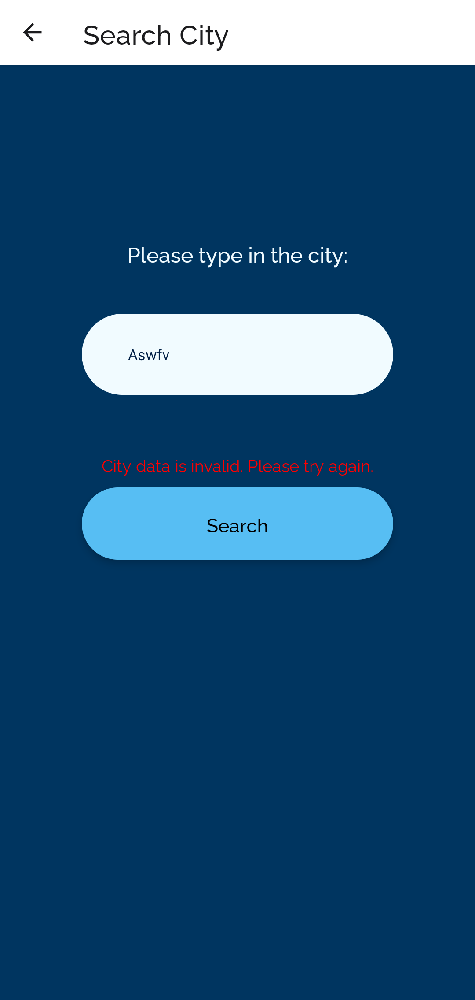
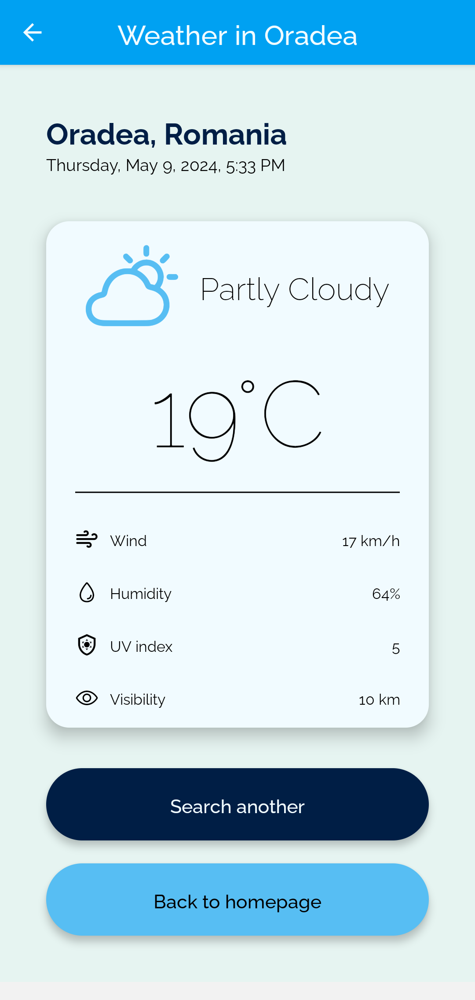
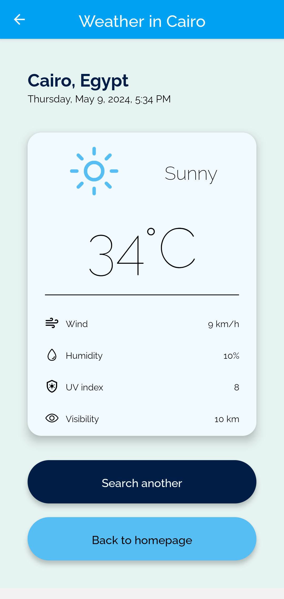

# Weather Forecast

## App built using React Native & Expo CLI

## Brief

The Weather Forecast app provides real-time weather information for cities around the world. Users can search for a specific city and view details such as current temperature, weather condition, wind speed, humidity, UV index, and visibility. The app also displays a daily forecast with a graphical representation of weather conditions. Users can easily navigate between screens to search for different cities, view detailed weather information, and return to the home screen. The app ensures a seamless user experience with intuitive navigation and visually appealing design.

## Technologies Used

- React Native
- Expo Go
- Weather API
- Stack Navigation

## Screenshots

## Contact

For any questions or inquiries, please feel free to reach out to me at sabinacristea997@gmail.com.
